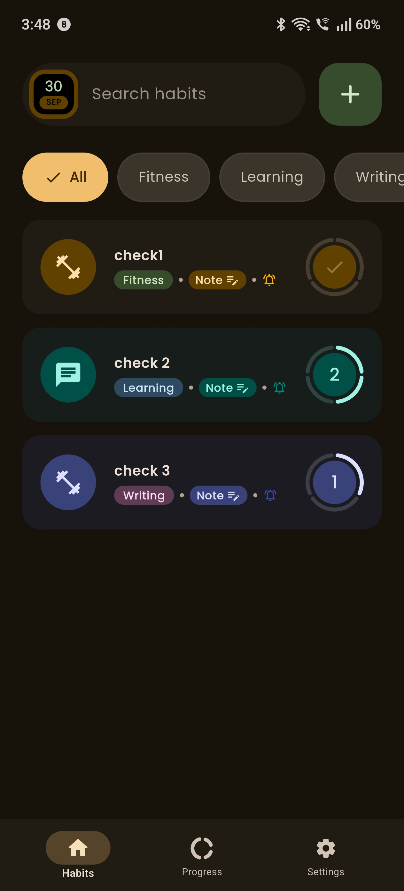
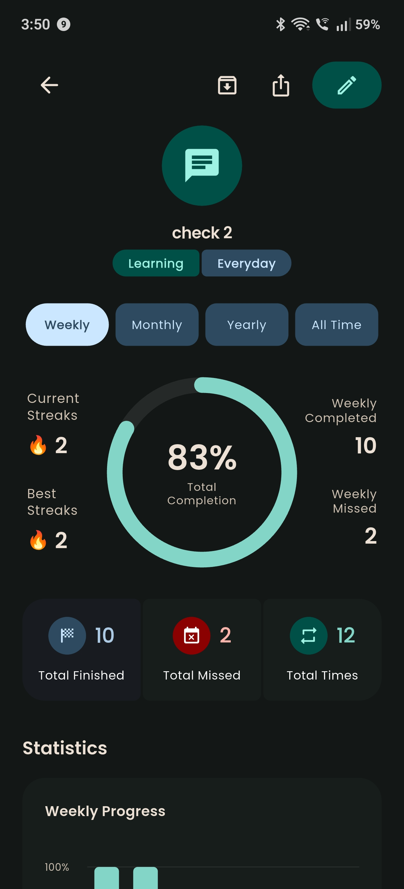
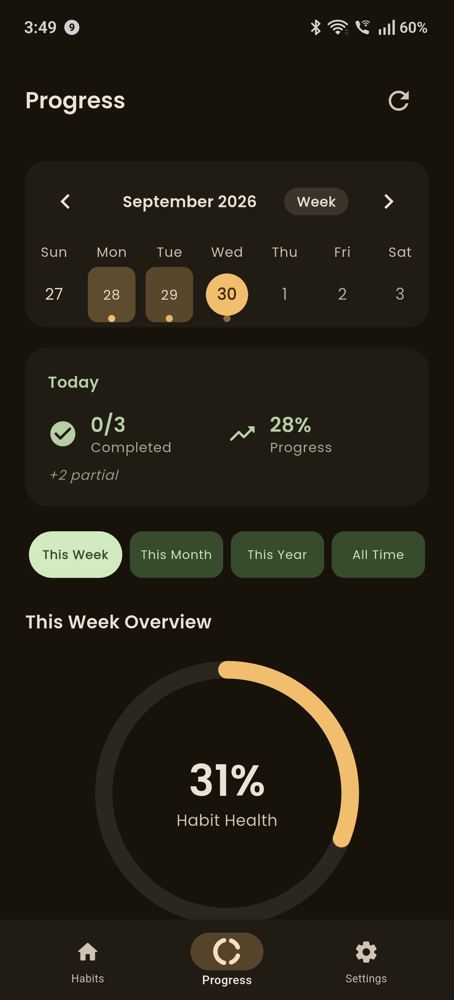
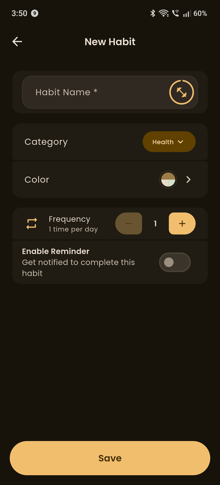
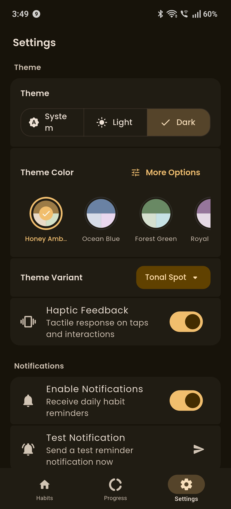

# 🌟 HabitBee

  

  
  
  

  <strong>Build Better Habits, One Day at a Time</strong>

  An offline-first Habit Tracker application built with Flutter, featuring a Material 3 Expressive UI with a unique honeycomb design theme.

---

## 📱 Screenshots

  
  
  

  
  

---

## ✨ Features

### 🎯 Core Functionality
| Feature | Description |
|---------|-------------|
| ✨ **Create Habits** | Add habits with custom names, categories, colors, and icons |
| ✅ **Daily Tracking** | Mark habits complete for any date with a single tap |
| 📝 **Daily Notes** | Attach personal notes to any habit completion for any date |
| 📅 **Date Navigation** | Honeycomb-style date picker for easy navigation |
| ⏰ **Smart Reminders** | Daily reminders with per-day repeat schedules and accurate device-timezone detection |
| 📊 **Progress & Analytics** | Redesigned progress screen with streaks, charts and detailed per-habit statistics |
| 🗂️ **Archive Habits** | Archive habits without losing history, restore them anytime |
| 🌙 **Dark Mode** | Full support for both light and dark themes |

### 🎨 Personalization
| Feature | Description |
|---------|-------------|
| 🎨 **Dynamic Color Themes** | Pick any seed color and Material 3 scheme variant — the whole app adapts |
| 🖌️ **Habit-Tinted Cards** | Every habit card generates its own Material 3 color scheme from its color |
| 📳 **Haptic Feedback** | Optional subtle haptics for taps and habit completions |
| 🐝 **Native Splash Screen** | Branded splash screen on Android & iOS (light and dark) |

### 🔒 Privacy & Data
| Feature | Description |
|---------|-------------|
| 💾 **Offline-First** | All data stored locally using Hive database |
| 🔐 **No Account Required** | Your data stays on your device |
| 🔄 **Safe Upgrades** | Tolerant data parsers keep old data working across app updates |
| 📦 **Lightweight** | Minimal storage and battery usage |

---

## 📄 License

  

  This project is licensed under the MIT License - see the <a href="LICENSE">LICENSE</a> file for details.

---

## 👨‍💻 Developer

  <strong>Mustafa Sheliya</strong>

  

---

  Made with ❤️ using Flutter

